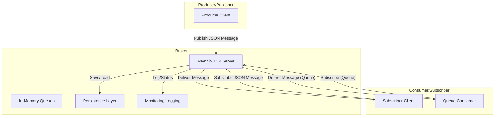

# msg

msg short for message but also monosodium glutamate. A simple, extensible, and easy-to-debug Python message broker. Supports pub/sub and point-to-point (queue) messaging with a minimal JSON protocol over TCP. Built for clarity, reliability, and Pythonic integration.

---

## Features
- **Asyncio-based**: Handles many clients efficiently with Python's standard library.
- **Pub/Sub & Queue**: Both publish/subscribe and point-to-point (queue) messaging patterns.
- **Persistence**: File-based message persistence for reliability.
- **Simple Protocol**: JSON over TCP, easy to debug and extend.
- **Monitoring**: Built-in logging and queue status reporting.
- **Minimal Dependencies**: Pure Python, installable with `uv` or `pip`.

---

## Architecture



---

## Quick Start

### Install
```bash
uv pip install .
```

### Run the Broker
```bash
python -m msg  # or python -m msg.broker (both supported)
```

### Example: Publish a Message
```python
import asyncio
import json

async def publish_message():
    reader, writer = await asyncio.open_connection('localhost', 8888)
    msg = json.dumps({"action": "publish", "topic": "news", "message": "Hello, world!"})
    writer.write(msg.encode())
    await writer.drain()
    data = await reader.read(1024)
    print("ACK:", data.decode())
    writer.close()
    await writer.wait_closed()

asyncio.run(publish_message())
```

### Example: Subscribe to a Topic
```python
import asyncio
import json

async def subscribe():
    reader, writer = await asyncio.open_connection('localhost', 8888)
    msg = json.dumps({"action": "subscribe", "topic": "news"})
    writer.write(msg.encode())
    await writer.drain()
    while True:
        data = await reader.read(1024)
        if not data:
            break
        print("Received:", json.loads(data.decode()))
    writer.close()
    await writer.wait_closed()

# Run in another script or terminal:
# asyncio.run(subscribe())
```

---

## Protocol

All communication is via JSON messages over TCP sockets.

- **Publish:**
  ```json
  {"action": "publish", "topic": "news", "message": "Hello!", "mode": "pubsub"}
  ```
- **Subscribe:**
  ```json
  {"action": "subscribe", "topic": "news", "mode": "pubsub"}
  ```
- **Queue Publish:**
  ```json
  {"action": "publish", "topic": "jobs", "message": "do work", "mode": "queue"}
  ```
- **Queue Subscribe:**
  ```json
  {"action": "subscribe", "topic": "jobs", "mode": "queue"}
  ```
- **ACK:**
  ```json
  {"type": "ack", "message_id": "..."}
  ```
- **Delivered Message:**
  ```json
  {"type": "message", "topic": "news", "message": "Hello!", "message_id": "..."}
  ```
- **Error:**
  ```json
  {"type": "error", "error": "...", "message_id": "..."}
  ```

---

## Persistence
- Messages are saved to `.msg_data/` as JSON files per topic/queue.
- On broker restart, undelivered messages are reloaded.
- The persistence layer is implemented in `msg/persistence.py`.

---

## Testing
- Unit and end-to-end integration tests are provided in the `tests/` directory.
- Run all tests:
  ```bash
  uv pip install pytest pytest-asyncio
  pytest
  ```
- Example tests include:
  - Saving and loading pub/sub messages.
  - Saving and loading queue messages.
  - Deleting messages.

---

## Contributing
- Fork, branch, and submit pull requests.
- All code should be type-annotated and documented.
- Please add or update tests for new features.
